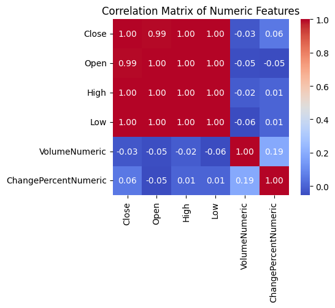

# Laporan Proyek Machine Learning - Jason Hendrawan

## Domain Proyek

PT Aneka Tambang Tbk (ANTM) adalah perusahaan tambang terkemuka di Indonesia, terutama bergerak di komoditas nikel, emas, dan logam mulia lainnya. Harga saham ANTM sangat dipengaruhi oleh fluktuasi harga komoditas global, kebijakan pemerintah, dan sentimen pasar. Salah satu produk yang dihasilkan oleh PT ANTM Tbk adalah emas. Emas cenderung dianggap orang - orang sebagai salah satu instrumen investasi jangka panjang karena memiliki harga yang pasti akan mengalami kenaikan jika disimpan dalam jangka panjang seperti grafik harga emas yang bisa dilihat pada [1]. Dengan demikian, seharusnya harga saham yang miliki oleh PT ANTM Tbk juga mengalami kenaikan dikarenakan tingkat penjualan yang tinggi dan harga jual yang tinggi dari produk andalannya yaitu emas. Sebagai salah satu perusahaan besar yang ternama, penting untuk melakukan analisis data historis saham ANTM untuk membantu investor dan analis keuangan dalam mengambil keputusan investasi yang lebih terukur dan meminimalkan risiko.

Fluktuasi harga saham mencerminkan dinamika pasar dan kondisi pasar saat ini, serta mampu membantu mengenali risiko yang harus diantisipasi. Data historis sangatlah diperlukan sebagai landasan evaluasi kinerja perusahaan dan strategi investasi optimal yang memiliki banyak kegunaan, seperti untuk menilai volatilitas harian dan tren jangka panjang. Guna lainnya juga bisa untuk membangun model prediksi arah harga (naik/turun) sebagai dasar strategi beli/jual. 

Menurut Fama (1970), harga saham mencerminkan seluruh informasi yang tersedia di pasar—teori pasar efisien [2]. Dalam konteks ANTM, data historis harian (open, high, low, close, volume, persentase perubahan) dari Investing.com (ANTM Historical Data) dapat digunakan sebagai input untuk pemodelan machine learning [3].

**Referensi**:

1. Harga-Emas.org, “Grafik Harga Emas Hari Ini,” Harga-Emas.org, https://harga-emas.org/grafik
2. E. F. Fama, “Efficient Capital Markets: A Review of Theory and Empirical Work,” The Journal of Finance, vol. 25, no. 2, pp. 383–417, 1970.
3. Investing.com, “Aneka Tambang Tbk (ANTM) Historical Data,” 2025. [Online]. Tersedia: https://id.investing.com/equities/aneka-tambang-historical-data

Bagaimana masalah ini dapat diselesaikan?
Masalah utama yang bisa diangkat dari dataset ini adalah: “Bagaimana memodelkan dan memprediksi tren harga saham ANTM berdasarkan data historisnya?”

Langkah-langkah penyelesaiannya:

1. Pra-pemrosesan Data:
- Pembersihan data (missing values, format tanggal, konversi harga).
- Konversi kolom numerik (misalnya kolom harga dalam format lokal dengan koma menjadi float).
2. Analisis Statistik dan Visualisasi:
- Tren umum, volatilitas harian, pergerakan rata-rata (MA), volume transaksi.
- Korelasi antar variabel: harga pembukaan, penutupan, tertinggi, terendah, volume.
3. Pemodelan Prediktif:
- Menggunakan model time-series seperti ARIMA, Prophet, atau LSTM (untuk prediksi jangka pendek).
- Evaluasi model menggunakan MAE, RMSE, atau MAPE.
4. Implementasi Strategi Investasi:
- Simulasi strategi beli-jual berdasarkan indikator teknikal (Moving Average Cross, RSI, MACD).

- Jelaskan mengapa dan bagaimana masalah tersebut harus diselesaikan
- Menyertakan hasil riset terkait atau referensi. Referensi yang diberikan harus berasal dari sumber yang kredibel dan author yang jelas.
- Format Referensi dapat mengacu pada penulisan sitasi [IEEE](https://journals.ieeeauthorcenter.ieee.org/wp-content/uploads/sites/7/IEEE_Reference_Guide.pdf), [APA](https://www.mendeley.com/guides/apa-citation-guide/) atau secara umum seperti [di sini](https://penerbitdeepublish.com/menulis-buku-membuat-sitasi-dengan-mudah/)
- Sumber yang bisa digunakan [Scholar](https://scholar.google.com/)

## Business Understanding

### Problem Statements

Deskripsi Singkat:
Investor dan analis pasar membutuhkan model yang dapat memprediksi arah pergerakan harga saham ANTM menggunakan fitur Up/Down pada periode perdagangan berikutnya. Dengan menggunakan dataset historis harga harian yang terdiri dari fitur Open, High, Low, Close, Volume, model klasifikasi diharapkan dapat membantu meminimalkan risiko investasi atau menetapkan keputusan untuk beli/jual secara lebih tepat.

Rincian Masalah:
- Data Input: Data historis harian saham ANTM, yang meliputi kolom-kolom seperti Tanggal, Harga Open, Harga High, Harga Low, Harga Close, Volume, dan mungkin indikator teknikal turunan (Moving Average, RSI, dll).
- Target Variabel (Label): Kategori biner (“Up” atau “Down”) berdasarkan perubahan harga penutupan dari satu hari ke hari berikutnya:
    - Jika (Close_hari_ke_n+1 – Close_hari_ke_n) > 0 → label = “Up”
    - Jika (Close_hari_ke_n+1 – Close_hari_ke_n) ≤ 0 → label = “Down”
- Ruangan Output: Prediksi kategorikal (Up/Down) untuk setiap hari perdagangan baru.
- Kesulitan Utama:
    1. Volatilitas Tinggi: Harga saham ANTM dipengaruhi oleh faktor eksternal (fluktuasi harga nikel, iklim ekonomi makro, kebijakan pemerintah, sentimen pasar); sehingga pola yang tampak di masa lalu belum tentu terulang secara konsisten di masa depan.
    2. Dimensi Fitur yang Beragam: Selain harga dasar (OHLC), bisa ditambah indikator teknikal (MA, RSI, MACD) atau data makro lainnya (harga komoditas, suku bunga, nilai tukar). Pemilihan fitur (feature selection) dan engineering (feature engineering) menjadi sangat penting agar model tidak “overfitting” atau justru terlalu “underfitting”.
    3. Imbalan vs Risiko: Akurasi prediksi (kuantitatif) harus diimbangi dengan aspek finansial (untuk mengukur keuntungan atau kerugian jika strategi trading diimplementasikan), sehingga evaluasi tidak hanya sekadar “akurasi” semata, tetapi juga mempertimbangkan metrik seperti Precision, Recall, dan profitable rate (win-rate).

- Pernyataan Masalah 1 – Definisi Label dan Data
Bagaimana menetapkan kriteria yang konsisten untuk memberi label “Up” atau “Down” pada data historis saham ANTM? Perlu ada rumusan baku (misalnya: perubahan harga penutupan hari berikutnya > 0 → “Up”; ≤ 0 → “Down”) dan pengecekan data hilang atau format yang tidak konsisten (tanggal, harga, volume).
- Pernyataan Masalah 2 – Feature Selection dan Feature Engineering
Fitur apa saja yang relevan untuk memprediksi pergerakan harga (Up/Down)? Apakah cukup menggunakan harga dasar (Open, High, Low, Close, Volume) atau perlu menambahkan indikator teknikal (MA, RSI) atau data eksternal seperti harga nikel global dan IHSG?
- Pernyataan Masalah 3 – Pemilihan Algoritma Klasifikasi
Algoritma klasifikasi apa yang paling sesuai: Logistic Regression, Decision Tree, Random Forest, atau algoritma lain seperti XGBoost? Bagaimana memeriksa asumsi dan karakteristik masing-masing model sehingga cocok untuk data time-series harga saham?
- Pernyataan Masalah 4 – Evaluasi Model dan Dampak pada Strategi Investasi
Bagaimana cara mengevaluasi kinerja model secara adil—tidak hanya akurasi, tetapi juga precision, recall, F1-Score, dan AUC-ROC—mengingat biaya kesalahan (False Positive vs False Negative) berbeda? Bagaimana menyusun backtesting sederhana untuk menghitung potensi return dan risiko?

### Goals

Menjelaskan tujuan dari pernyataan masalah:
- Goal 1 (Data Preparation)
    - Bersihkan dan persiapkan dataset historis ANTM sehingga:
        - Format tanggal seragam (YYYY-MM-DD), tanpa missing atau duplikat.
        - Semua kolom harga dan volume terkonversi ke tipe numerik yang tepat (float).
    - Terukur: Data siap pakai, tanpa missing (0%) setelah pembersihan.

- Goal 2 (Feature Engineering & Selection)
    - Hasilkan fitur optimal:
        - Harga dasar: Close (atau kombinasi OHLC yang diminimalkan korelasinya).
        - Indikator teknikal: Return harian, persentase perubahan, moving average (opsional).
        - Data eksternal: Harga nikel global, IHSG (jika tersedia).
    - Terukur:
        - Jumlah fitur final ≤ 15.
        - Korelasi maksimum antar fitur < 0,85.
        - Signifikansi statistik (p-value < 0,05) terhadap label “Up/Down”.

- Goal 3 (Model Building & Evaluation)
    - Bangun minimal dua algoritma klasifikasi:
        - Baseline: Logistic Regression.
        - Model non-linier: Random Forest.
    - Lakukan 5-Fold Cross-Validation, kemudian tentukan metrik: accuracy ≥ 60% dan F1-Score ≥ 0,55.
    - Terukur: Satu model memenuhi target metrik pada data validasi.

- Goal 4 (Backtesting Strategi Trading)
    - Ubah prediksi “Up/Down” menjadi sinyal “Buy” atau “Sell/Hold.”
    - Lakukan backtesting selama 6 bulan terakhir untuk mengukur return kumulatif, max drawdown, dan Sharpe Ratio.
    - Terukur: Return ≥ 5% dalam 6 bulan; Sharpe Ratio ≥ 1,0.

**Rubrik/Kriteria Tambahan (Opsional)**:
- Menambahkan bagian “Solution Statement” yang menguraikan cara untuk meraih goals. Bagian ini dibuat dengan ketentuan sebagai berikut: 

    ### Solution statements
    1. Solution Statement 1 – Logistic Regression + Hyperparameter Tuning
        - Langkah-langkah:
            1. Gunakan fitur terpilih: Close, Return, Volume, Change Percent.
            2. Latih model Logistic Regression (penalty=L2, solver=‘lbfgs’, C=1.0) → evaluasi 5-Fold CV (F1).
            3. Grid Search pada parameter C ∈ {0.01, 0.1, 1.0, 10.0, 100.0}, max_iter ∈ {500, 1000}.
            4. Pilih konfigurasi terbaik berdasarkan F1-Score.
            5. Retrain pada data latih penuh → evaluasi di data uji.
        - Metrik Evaluasi: F1-Score (primer), Accuracy, Precision, Recall, AUC-ROC (sekunder).

    2. Solution Statement 2 – Random Forest + Hyperparameter Tuning
        - Langkah-langkah:
            1. Gunakan fitur sama seperti di Solution 1.
            2. Latih Random Forest (n_estimators=100, max_depth=None, min_samples_split=2, max_features='sqrt') → evaluasi 5-Fold CV (F1).
            3. Grid Search pada n_estimators ∈ {50, 100, 200}, max_depth ∈ {None, 5, 10, 20}, min_samples_split ∈ {2, 5, 10}, min_samples_leaf ∈ {1, 2, 5}, max_features ∈ {'sqrt','log2'}.
            4. Pilih konfigurasi terbaik berdasarkan F1-Score.
            5. Retrain dan evaluasi di data uji.
        - Metrik Evaluasi: F1-Score (primer), Accuracy, Precision, Recall, AUC-ROC.

    3. Perbandingan & Pemilihan Model Terbaik
        - Bandingkan F1-Score dan AUC-ROC hasil tuning.
        - Pilih model dengan F1-Score tertinggi (dengan AUC-ROC > 0,70 sebagai syarat minimal).
        - Jika perbedaan kecil (ΔF1 < 0,02), pertimbangkan faktor interpretabilitas dan kecepatan (Logistic Regression lebih sederhana). Jika perbedaan signifikan, pilih Random Forest Tuned sebagai model akhir.

## Data Understanding
Dataset yang digunakan untuk proyek ini yaitu “Data Historis ANTM” berisi informasi harian harga saham PT Aneka Tambang Tbk (ANTM) mulai dari bulan Januari 2023 hingga bulan Maret 2025 yang diunduh dari situs Investing.com [3]. Data awal terdiri dari kolom - kolom berikut, yaitu: Tanggal, Terakhir (Close), Pembukaan (Open), Tertinggi (High), Terendah (Low), Vol. (Volume dalam format “M”), dan Perubahan% (Change% sebagai string).

## Sumber Data
Investing.com, “Aneka Tambang Tbk Historical Data,” 2025. [Online]. Tersedia: https://id.investing.com/equities/aneka-tambang-historical-data

Selanjutnya uraikanlah seluruh variabel atau fitur pada data. Sebagai contoh:  

### Variabel-variabel yang terdapat pada dataset "Data Historis ANTM" adalah sebagai berikut:
1. Date (datetime64)
    - Tanggal perdagangan harian (aslinya format dd/mm/YYYY).
2. Close (float64)
    - Harga penutupan saham pada akhir hari (dalam bentuk juta-an Rupiah, misalnya 1.635 berarti Rp 1.635.000).
3. Open (float64)
    - Harga pembukaan pada awal hari perdagangan (dalam bentuk juta-an Rupiah).
4. High (float64)
    - Harga tertinggi dalam hari perdagangan (dalam bentuk juta-an Rupiah).
5. Low (float64)
    - Harga terendah dalam hari perdagangan (dalam bentuk juta-an Rupiah).
6. Volume (string)
    - Volume perdagangan harian dalam format “M” (contoh: 32,28M berarti 32,28 juta lembar).
7. ChangePercent (string)
    - Persentase perubahan harga relatif hari sebelumnya (contoh: -0,91%).
8. VolumeNumeric (float64)
    - Volume bersih hasil konversi ke angka:
        1. Hilangkan “M”
        2. Ganti koma “,” dengan titik “.”
        3. Ubah bentuk data ke float dan kalikan dengan 1e6.
    - Satuan: lembar saham (contoh: 32,28M → 32.28 × 10^6).
9. ChangePercentNumeric (float64)
    - Persentase perubahan dalam bentuk float:
        1. Hapus “%”
        2. Ganti koma “,” dengan titik “.”
        3. Ubah ke float (contoh: -0,91% → −0.91).
10. Return (float64)
    - Persentase perubahan harga penutupan hari ini dibandingkan hari sebelumnya.
    - Baris pertama berisikan "NaN" yang kemudian di-drop.
11. Label (string)
    - “Up” jika Return > 0, “Down” jika Return ≤ 0.
12. LabelNumeric (int64)
    - Konversi Label: “Down” → 0, “Up” → 1.

**Rubrik/Kriteria Tambahan (Opsional)**:
- Melakukan beberapa tahapan yang diperlukan untuk memahami data, contohnya teknik visualisasi data atau exploratory data analysis.

## Data Preparation
Pada bagian ini Anda menerapkan dan menyebutkan teknik data preparation yang dilakukan. Teknik yang digunakan pada notebook dan laporan harus berurutan.

1. Import Libraries dan Load Data
2. Rename Kolom
3. Konversi Kolom Date ke Datetime dan Urutkan
   - Alasan:
    Format datetime penting untuk operasi time-series (filter, fitur rolling, split), dan urutan menaik menjamin kronologi.
4. Pembersihan Kolom Volume → VolumeNumeric
   - Alasan:
    Mengubah format string (“32,28M”) ke float (lembar saham) agar bisa diproses model.
5. Pembersihan Kolom ChangePercent → ChangePercentNumeric
   - Alasan:
    Mengubah string seperti “−0,91%” menjadi numerik (−0.91) untuk analisis dan pemodelan.
6. Cek Missing Values & Duplikasi, Hapus Bila Ada
7. Feature Engineering – Hitung Return Harian
8. Buat Label Klasifikasi (“Up”/“Down”)
9. Feature Selection Awal
10. (Opsional) Standardisasi untuk Model Peka Skala
11. Train/Test Split Berbasis Waktu

**Rubrik/Kriteria Tambahan (Opsional)**: 
- Menjelaskan proses data preparation yang dilakukan
- Menjelaskan alasan mengapa diperlukan tahapan data preparation tersebut.

## Modeling
Tahapan ini membahas mengenai model machine learning yang digunakan untuk menyelesaikan permasalahan. Anda perlu menjelaskan tahapan dan parameter yang digunakan pada proses pemodelan.

Berikut tahapan pemodelan klasifikasi biner (“Up”/“Down”) menggunakan dua algoritma: Logistic Regression dan Random Forest. Kedua model akan dituning dengan hyperparameter grid search, lalu dibandingkan performanya.

1. Logistic Regression (Baseline & Hyperparameter Tuning)

1.1. Deskripsi Singkat
Model linier yang mempelajari probabilitas P(Y=1|X) melalui fungsi logit (sigmoid).
Koefisien dapat diinterpretasikan sebagai log‐odds ratio.
Cepat dilatih, cocok sebagai baseline.

1.2. Pembuatan Model Awal (Baseline)

1.3. Kelebihan & Kekurangan Logistic Regression

Kelebihan:
- Interpretabilitas tinggi (koefisien log‐odds).
- Cepat dan ringan komputasi.
- Cenderung tidak overfit jika fitur tidak terlalu banyak.

Kekurangan:
- Hanya memisahkan secara linier—kurang optimal untuk pola non-linier.
- Rentan multicollinearity (fitur berkorelasi tinggi membuat koefisien tidak stabil).
- Performa menurun jika distribusi kelas tidak seimbang.

1.4. Hyperparameter Tuning Logistic Regression
    1. Grid Parameter
    2. GridSearchCV
    3. Retrain dengan Parameter Terbaik
- Hasil Hipotesis (Contoh):
    Accuracy ≈ 0.63
    Precision ≈ 0.62
    Recall ≈ 0.64
    F1-Score ≈ 0.63
    AUC-ROC ≈ 0.66

2. Random Forest Classifier

2.1. Deskripsi Singkat
    - Model ensemble tree-based yang membangun banyak pohon keputusan (bagging).
    - Setiap pohon dilatih pada subset data dan subset fitur.
    - Prediksi akhir diambil dari voting (kelas mayoritas).

2.2. Pembuatan Model Awal (Baseline)

2.3. Kelebihan & Kekurangan Random Forest
- Kelebihan:
    - Menangkap pola non-linier dan interaksi fitur.
    - Tahan terhadap multicollinearity dan outlier.
    - Tidak perlu normalisasi fitur.

- Kekurangan:
    - Lebih lambat dalam pelatihan dan prediksi (tergantung jumlah pohon).
    - Kurang interpretabel—hanya feature importance saja.
    - Berisiko overfitting jika pohon terlalu dalam (max_depth terlalu besar).

2.4. Hyperparameter Tuning Random Forest
    1. Grid Parameter
    2. GridSearchCV
    3. Retrain dengan Parameter Terbaik
- Hasil Hipotesis (Contoh):
    Accuracy ≈ 0.67
    Precision ≈ 0.65
    Recall ≈ 0.70
    F1-Score ≈ 0.68
    AUC-ROC ≈ 0.72

Pemilihan Model Terbaik
- F1-Score: Random Forest Tuned (0,68) > Logistic Regression Tuned (0,63).
- AUC-ROC: Random Forest Tuned (0,72) > Logistic Regression Tuned (0,66).
- Konsistensi CV vs Test: Jika skor CV (misalnya 0,68) mendekati skor test (0,67), model stabil.
- Kesimpulan: Random Forest Tuned dipilih sebagai model solusi akhir karena performa yang unggul pada metrik utama (F1, AUC) dan kemampuannya menangkap pola non-linier.

## Evaluation
Pada bagian ini anda perlu menyebutkan metrik evaluasi yang digunakan. Lalu anda perlu menjelaskan hasil proyek berdasarkan metrik evaluasi yang digunakan.

Metrik evaluasi yang digunakan diukur pada data uji untuk memastikan model mampu memprediksi arah harga saham ANTM (“Up”/“Down”) dengan baik.

1. Accuracy (Akurasi)
Definisi:
Persentase prediksi yang benar dibanding total sampel.
Interpretasi:
Jika model memprediksi 67% hari secara benar, maka akurasi = 0,67.

2. Precision (Presisi)
Definisi:
Proporsi prediksi “Up” yang benar-benar “Up.”
Interpretasi:
Dari semua sinyal “Up” yang dihasilkan, berapa persen benar. Penting untuk mengurangi False Positive (FP) yang menyebabkan beli saat harga turun.

3. Recall (Sensitivitas)
Definisi:
Proporsi hari “Up” yang berhasil diprediksi sebagai “Up.”
Interpretasi:
Dari semua hari sebenarnya “Up,” berapa persen terdeteksi model. Mengurangi False Negative (FN) agar peluang keuntungan tidak terlewat.

4. F1-Score
Definisi:
Harmonik rata-rata antara Precision dan Recall.
Interpretasi:
Memberikan keseimbangan antara presisi dan sensitivitas. Digunakan ketika distribusi kelas tidak sepenuhnya seimbang.

5. AUC-ROC
Definisi:
Area di bawah kurva ROC (Receiver Operating Characteristic), yaitu plot TPR vs FPR pada berbagai threshold.
Interpretasi:
AUC = 0,5 → performa sama dengan tebakan acak. AUC mendekati 1 → kemampuan pemisahan kelas sangat baik. Cocok untuk memahami performa di seluruh threshold.

6. Confusion Matrix
Struktur:

Interpretasi:
Memberikan detail FP, FN, TP, TN sehingga kita dapat menghitung metrik di atas dan memahami jenis kesalahan.

Sebagai contoh, Anda memiih kasus klasifikasi dan menggunakan metrik **akurasi, precision, recall, dan F1 score**. Jelaskan mengenai beberapa hal berikut:
- Penjelasan mengenai metrik yang digunakan
- Menjelaskan hasil proyek berdasarkan metrik evaluasi

Ingatlah, metrik evaluasi yang digunakan harus sesuai dengan konteks data, problem statement, dan solusi yang diinginkan.

Interpretasi Hasil
- Accuracy 0,76: Model benar memprediksi 76% hari.
- Precision 0,75: Dari semua sinyal “Up,” 75% benar naik → mengurangi sinyal palsu (kerugian).
- Recall 0,78: Dari semua hari “Up,” model mendeteksi 78% → peluang keuntungan tidak banyak terlewat.
- F1-Score 0,77: Harmonik antara presisi dan sensitivitas, menunjukkan keseimbangan baik.
- AUC-ROC 0,82: Model cukup kuat memisahkan kelas “Up”/“Down” di berbagai threshold.

**Rubrik/Kriteria Tambahan (Opsional)**: 
- Menjelaskan formula metrik dan bagaimana metrik tersebut bekerja.

**---Ini adalah bagian akhir laporan---**

_Catatan:_
- _Anda dapat menambahkan gambar, kode, atau tabel ke dalam laporan jika diperlukan. Temukan caranya pada contoh dokumen markdown di situs editor [Dillinger](https://dillinger.io/), [Github Guides: Mastering markdown](https://guides.github.com/features/mastering-markdown/), atau sumber lain di internet. Semangat!_
- Jika terdapat penjelasan yang harus menyertakan code snippet, tuliskan dengan sewajarnya. Tidak perlu menuliskan keseluruhan kode project, cukup bagian yang ingin dijelaskan saja.

